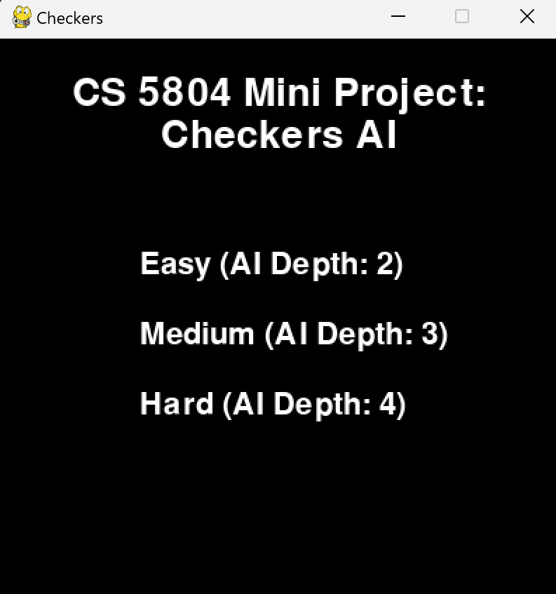
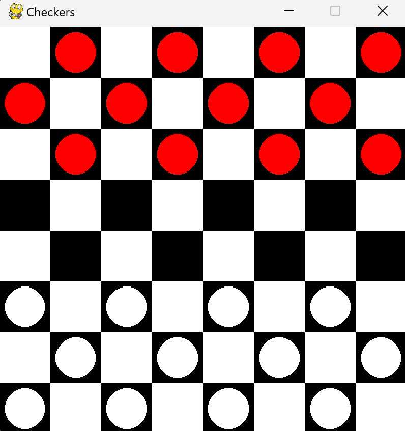
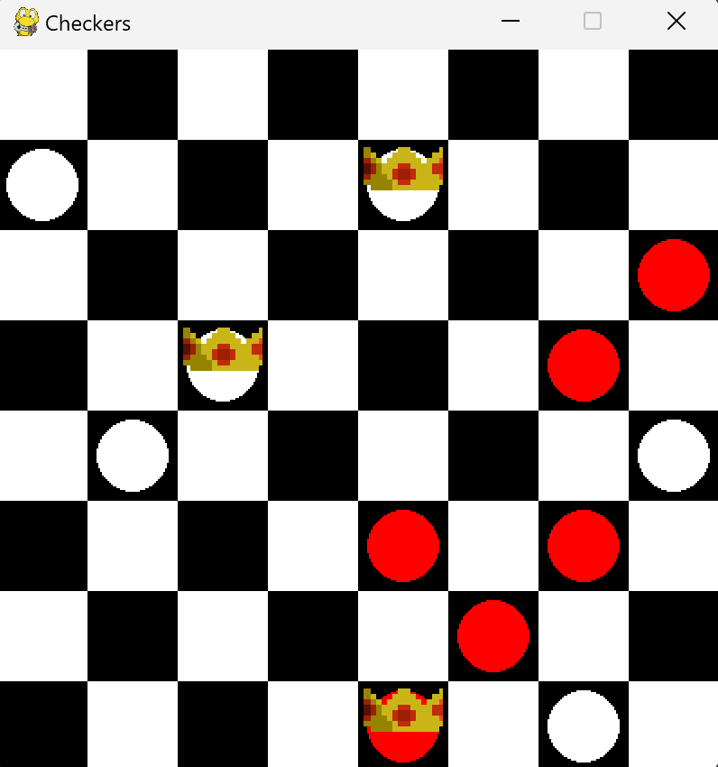
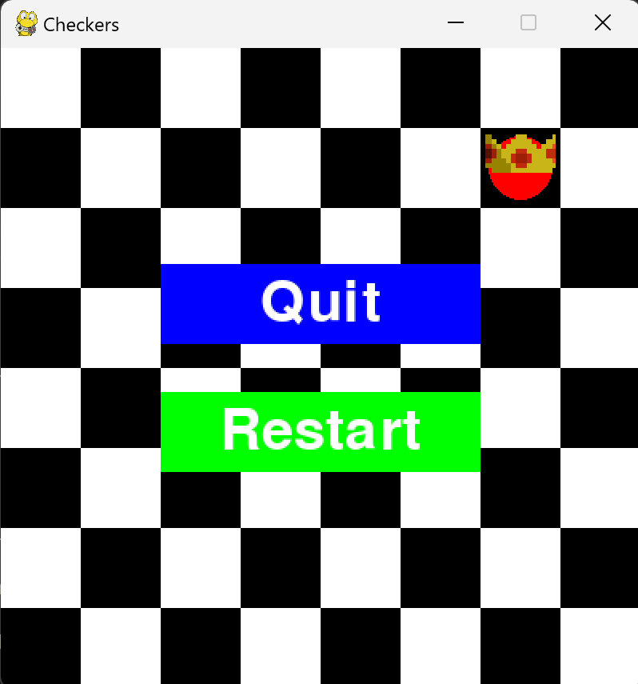

# AI-Checkers


## Description
Checkers is a well known and common 2-player board game that is played around the world. It has been relatively overlooked in the AI game world, with most focus being directed towards more complex games like chess and Go. <p>***We created an interactive checkers AI that is competitive with strong human players, equipped with its own strategies, to complete a challenging and thoughtful game of checkers.***<br>
<p>This program includes a fully functioning GUI which allows users to select from 3 levels of difficulty. After completing a game, users can chose to restart a new game or quit and close the GUI.
<br>


## AI Algorithm

This program utilizes Mini-Maxing with alpha beta pruning to determine the next best move. The user is the maximizing player while the AI is the minimizing player. Alpha beta prunig was implemented to prune poor moves and save computaion time. A heuristic evaluation function is used to evaluation each move, with more weights on more prominent features (ex. red/black kings has more weights compared to the regular red/black pieces).

<p>Depth was used to reflect varying levels of difficulty, with depth sizes of 2, 3, and 4 being easy, medium, and hard, respectively. Note that as the depth level increases, a slight delay occurs on each move of the AI. This occurs because greater depth size results in a higher time complexity to generate and evaluate all possible moves.<br>


## Installation
1. Clone the repository
```s
git clone https://git.cs.vt.edu/sarahrambo/ai-checkers.git
```

2. Install the dependancies using the provided requirements.txt file
```s
pip install -r requirements.txt

```
3. Launch the program and being playing checkers
```s
py CheckersGUI.py
```

## Usage
This project is primarily targeted towards board game enthusiasts, checker players and individuals who might want to improve their game skills. Users should have prior knowledge of the rules and end goal of checkers, and will be able to interact with a graphical user interface to input moves and view opponent moves. 

## Flow
* Human player launches the AI-integrated checkers game
* Human player selects the desired difficulty level of the AI opponent
* Program populates the board with tiles and game pieces
* Human player makes a move*
* AI opponent makes a move*
* Repeat * process until one player wins the game
* Game displays who won and offers an option to play again or quit

## Visuals

1. Start screen to select level of difficulty

 


2. Populated board at beginning of game

 


3. Board mid game with kings

 

4. End screen at completion of game

 


## Future Work
* Implementation of double and triple jumps
* Creation of a hints or move recommendation system for user


## Authors and Acknowledgment
This project was created as an assignment for Virginia Tech's CS 5804: Intro to Artificial Intelligence. We'd like to express our gratitude to the teaching staff of this course, and especially to Dr. Yinlin Chen for a great semester. 

<p>This project was made possible through the collaboration of<br>

* Alina Bhatti
* Liam Davis-Wallace
* Alex Marrero
* Sarah Ramboyong
* John Swecker


